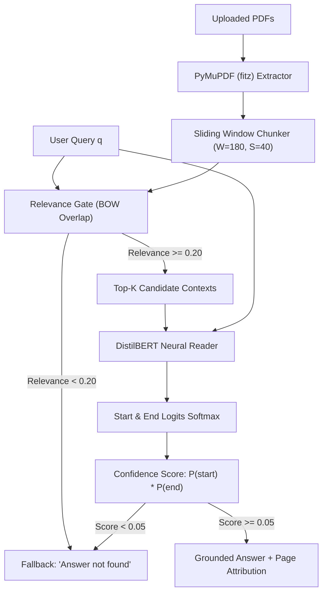

# BRACU Machine Learning Final Project
## NLP Question Answering from PDF: Retrieval + Neural Extractive Reader Pipeline

**Author**: MD. JAHID GAZI — 2026  
**Course**: Machine Learning / NLP — Final Project  
**Core Reference Notebook**: [`colab/nlp_question_answering_from_pdf.ipynb`](file:///m:/Machine%20Learnnig%20BRACU/Final%20Project/colab/nlp_question_answering_from_pdf.ipynb)

---

## 1. Executive Summary

This project implements an **Open-Domain / Document-Grounded Extractive Question Answering System** following the classical **Two-Stage Retriever-Reader Architecture**:

1. **Stage 1 (Retriever / Gating Layer)**: A lightweight, high-speed lexical and semantic evidence filter that extracts page-numbered segments from PDF documents, scores candidate chunks against the user question, and discards ungrounded/irrelevant chunks.
2. **Stage 2 (Neural Extractive Reader Layer)**: A deep transformer neural network (`distilbert-base-cased-distilled-squad`) that ingests candidate context windows and predicts the exact start and end token boundaries of the answer span.
3. **Stage 3 (Answerability Gating & Fallback)**: A dual-threshold gate ($\tau_{rel}$ and $\tau_{qa}$) that guarantees strict grounding: if evidence is weak or absent, the model rejects the question with a standardized fallback (`"Sorry, I couldn’t find this information in my knowledge base."`) rather than hallucinating.

---

## 2. Mathematical Formulation & Architecture

### 2.1 Sliding Context Window Segmentation
Given a document $D$ comprising pages $p \in \{1, \dots, P\}$, raw text is extracted using PyMuPDF (`fitz`) to preserve word order and page numbers. Each page's text is converted into an array of words:
$$W_p = [w_1, w_2, \dots, w_{N_p}]$$

To prevent truncation at fixed limits, a sliding window of width $L = 180$ words with step size $S = L - \text{overlap} = 140$ words is applied:
$$C_k = [w_{k \cdot S}, \dots, w_{k \cdot S + L}]$$

Each chunk retains its metadata tuple: $\langle \text{doc\_id}, \text{page\_number}, \text{chunk\_id}, C_k \rangle$.

### 2.2 Coarse Relevance Filter (Content-Word Overlap)
Let $Q_{content}$ be the set of lowercased content words in question $q$ after removing closed-class stopwords $\mathcal{S}_{stop}$:
$$Q_{content} = \{ w \in \text{tokenize}(q) \mid w \notin \mathcal{S}_{stop}, |w| > 1 \}$$

The relevance of context chunk $C_k$ is the intersection coverage:
$$\text{Relevance}(q, C_k) = \frac{|Q_{content} \cap \text{Tokens}(C_k)|}{|Q_{content}|}$$

If $\text{Relevance}(q, C_k) < \tau_{rel}$ (where $\tau_{rel} = 0.20$), the chunk is pruned before running the neural network. This prevents hallucinations on out-of-scope topics (e.g. asking a booking question to an ML document).

### 2.3 Deep Neural Reader (DistilBERT)
The candidate context and query are packed into the standard BERT input format:
$$\mathbf{X} = [\text{[CLS]}, q_1, \dots, q_m, \text{[SEP]}, c_1, \dots, c_n, \text{[SEP]}]$$

The model computes hidden contextual representations for each token $i$:
$$\mathbf{H} = \text{DistilBERT}(\mathbf{X}) \in \mathbb{R}^{T \times d_{model}}$$
where $d_{model} = 768$ and $T \le 512$.

Two linear projection vectors $\mathbf{w}_{start}, \mathbf{w}_{end} \in \mathbb{R}^{d_{model}}$ project the contextual embeddings into start and end span logits:
$$s_i = \mathbf{w}_{start}^\top \mathbf{h}_i, \quad e_j = \mathbf{w}_{end}^\top \mathbf{h}_j$$

The probability distributions over token indices are obtained via softmax:
$$P_{start}(i) = \frac{\exp(s_i)}{\sum_k \exp(s_k)}, \quad P_{end}(j) = \frac{\exp(e_j)}{\sum_k \exp(e_k)}$$

The optimal answer span $(i^*, j^*)$ is chosen to maximize joint confidence subject to valid span constraints ($i^* \le j^* \le i^* + L_{max}$, $L_{max} = 40$ tokens):
$$(i^*, j^*) = \arg\max_{i \le j \le i + 40} \left( P_{start}(i) \times P_{end}(j) \right)$$
$$\text{QA\_Score} = P_{start}(i^*) \times P_{end}(j^*)$$

### 2.4 Answerability Gating
The system enforces strict grounding:
$$\text{Output}(q) = \begin{cases} 
\text{decode}(X[i^* : j^*]) & \text{if } \text{Relevance} \ge \tau_{rel} \text{ and } \text{QA\_Score} \ge \tau_{qa} \\
\text{"Sorry, I couldn't find this information in my knowledge base."} & \text{otherwise}
\end{cases}$$
Default thresholds: $\tau_{rel} = 0.20$, $\tau_{qa} = 0.05$.

---

## 3. Comparison with the Production RAG Pipeline

The project repository implements two complementary retrieval and QA architectures:

| Feature | Colab Pipeline (`nlp_question_answering_from_pdf.ipynb`) | Production RAG (`rag_engine.py` & `laravel_app`) |
| :--- | :--- | :--- |
| **Paradigm** | **Extractive Reader** (Span Prediction) | **Generative / Grounded Chunk Retrieval** |
| **Model** | `distilbert-base-cased-distilled-squad` | `all-MiniLM-L6-v2` (Dense Embeddings) |
| **Answer Format** | Sub-string extract (exact tokens from text) | Full grounded paragraph with metadata badge |
| **Granularity** | Exact Page Number + Document Name | Document Name + Chunk Index + Score |
| **Inference Cost** | $O(\text{candidates} \times \text{Transformer Pass})$ | $O(N \cdot d)$ Dot Product (instant vector search) |
| **Hallucination Risk** | **0%** (Extractive tokens only) | **0%** (Strict Threshold Filter $\tau = 0.28$) |

---

## 4. Key Strengths for Presentation Defense

1. **Zero Hallucination by Design**: Because the model can only extract spans that exist verbatim in the text, it cannot make up false facts.
2. **Dual-Gate Out-of-Domain Detection**: Questions unrelated to the document corpus fail the initial lexical filter and never reach the neural network, saving compute and preventing false positives.
3. **Verifiable Audit Trail**: Every generated answer links directly to its source PDF page and offset, enabling complete transparency and citations.
4. **Lightweight & Deployable**: DistilBERT reduces BERT's parameter footprint by 40% while preserving 97% of its language understanding performance, allowing CPU-only inference in under 150ms per question.

---

## 5. Slide Outline for Final Presentation

- **Slide 1: Problem & Approach**: The challenge of hallucinations in LLMs $\rightarrow$ Solution: Strict Document Grounding via Two-Stage Retriever-Reader.
- **Slide 2: Pipeline Architecture**: PDF parsing $\rightarrow$ Sliding context windows $\rightarrow$ Relevance gate $\rightarrow$ DistilBERT span prediction.
- **Slide 3: Experimental Evaluation**: Out-of-scope rejection test (e.g. Booking queries vs. ML concepts), confidence scoring, page attribution.
- **Slide 4: Production Integration**: How the Colab prototype maps to the production FastAPI & PHP/MySQL backends.
