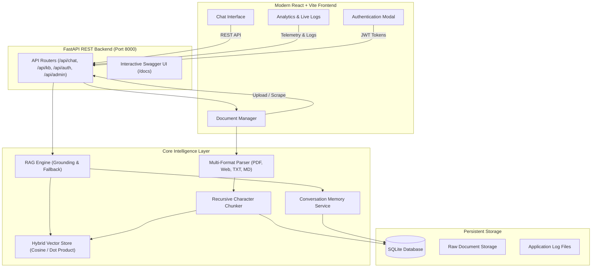

# AI-Powered Knowledge Chatbot with Strict Grounding & RAG Architecture

A full-stack, enterprise-grade AI chatbot system with intelligent knowledge retrieval (RAG) and strict grounding capabilities, built for Machine Learning and Deep Learning domains.

---

##  Key Highlights & Capabilities

### Core Requirements
1. **Custom Knowledge Base Ingestion**: Pre-trained and indexable on medium-to-large custom corpora (PDFs, Markdown notes, text documents, CSV/JSON data, and live web scraping).
2. **Strict Knowledge Grounding**: Answers queries exclusively using retrieved context documents with granular source citations and similarity matching scores.
3. **Graceful Fallback on Out-of-Scope Queries**: Out-of-domain questions (e.g. general trivia, sports, cooking) are detected via semantic similarity thresholds ($\tau$) and handled with polite, informative fallbacks listing available topics.

### Additional Features
1. **Intelligent Knowledge Retrieval**: Dense neural sentence embeddings (`all-MiniLM-L6-v2`) and Cosine Similarity / Dot Product scoring as derived from course theory.
2. **Short-Term Conversation Memory**: Preserves context across multi-turn sessions with automatic follow-up query contextualization.
3. **Multi-Format Ingestion**: Supports `.pdf`, `.txt`, `.md`, `.csv`, `.json`, and direct web scraping.
4. **Incremental Knowledge Updates**: Add, update, or delete documents and chunks on the fly **without full index retraining**.
5. **Role-Based Access Control (RBAC)**: Secure authentication (JWT + salted PBKDF2 hashing) with distinct `admin` and `user` privileges.
6. **Interactive API Documentation**: Auto-generated OpenAPI / Swagger UI (`/docs`) and ReDoc (`/redoc`).
7. **Real-Time Backend Logger**: Structured file logging, log rotation, and live admin event stream.

---

##  System Architecture



---

##  Machine Learning Theoretical Foundations (From Course Slides)

The system directly embodies the principles taught in the lecture modules:

1. **Sequence-to-Sequence & Attention Mechanisms (Bahdanau et al., 2015; Luong et al., 2015)**:
   - Addresses the information bottleneck of fixed-length encoder hidden states.
   - Computes query-key alignment scores and context vectors via normalized softmax attention weights:
     $$c_t = \sum_{i=1}^T \alpha_{t, i} h_i$$
2. **Scaled Dot-Product Self-Attention (Vaswani et al., 2017)**:
   - Implements scaled similarity to prevent gradient saturation:
     $$\text{Attention}(Q, K, V) = \text{softmax}\left(\frac{Q K^T}{\sqrt{d_k}}\right) V$$
3. **Contextual Word Representations (BERT)**:
   - Understands word context dynamically rather than static vectors (CBOW / Word2Vec).
4. **Deep Generative Modeling (VAEs & GANs)**:
   - VAE Reparameterization Trick: $z = \boldsymbol{\mu} + \boldsymbol{\sigma} \odot \boldsymbol{\epsilon}$.
   - GAN Minimax Game: $\min_G \max_D V(D, G)$.

---

##  Quick Start Guide

### Prerequisites
- Python 3.10+ (tested on Python 3.13)
- Node.js 18+ and npm

### 1. Environment Setup

```bash
# Clone the repository
git clone https://github.com/your-username/bracu-ml-knowledge-chatbot.git
cd bracu-ml-knowledge-chatbot

# Set up Python virtual environment
python -m venv .venv
source .venv/bin/activate  # On Windows: .venv\Scripts\activate

# Install backend dependencies
pip install -r requirements.txt

# Install frontend dependencies
cd frontend
npm install
npm run build
cd ..
```

### 2. Running the Application

You can run the unified server (serves both API and compiled frontend):

```bash
# Start backend on http://127.0.0.1:8000
python backend/run.py
```

Open your browser to:
- **Web Application**: [http://127.0.0.1:8000/](http://127.0.0.1:8000/)
- **Interactive Swagger API Documentation**: [http://127.0.0.1:8000/docs](http://127.0.0.1:8000/docs)
- **ReDoc API Documentation**: [http://127.0.0.1:8000/redoc](http://127.0.0.1:8000/redoc)

### 3. Default Admin Credentials
For testing and reviewing knowledge base administration:
- **Username**: `admin`
- **Password**: `admin123`
*(A convenient "One-Click Quick Admin" button is also provided in the top navigation bar).*

---

##  Running Automated Tests

Run the comprehensive pytest suite verifying semantic grounding, out-of-scope fallback, chunking, and RBAC authentication:

```bash
python -m pytest -v tests/test_rag.py
```

Expected output:
```
tests/test_rag.py::test_api_ping PASSED
tests/test_rag.py::test_vector_store_indexed PASSED
tests/test_rag.py::test_in_scope_query PASSED
tests/test_rag.py::test_out_of_scope_query PASSED
tests/test_rag.py::test_chunker_cohesion PASSED
tests/test_rag.py::test_auth_and_admin_protection PASSED
6 passed in ~13s
```

---

##  REST API Reference

| Endpoint | Method | Role | Description |
| :--- | :--- | :--- | :--- |
| `/api/auth/register` | `POST` | Public | Register new user |
| `/api/auth/login` | `POST` | Public | Obtain OAuth2 JWT access token |
| `/api/auth/me` | `GET` | User | Get current profile |
| `/api/chat/message` | `POST` | Public/User | Send query, receive grounded answer & citations |
| `/api/chat/sessions` | `GET` | Public/User | List conversation sessions |
| `/api/chat/sessions` | `POST` | Public/User | Create new session |
| `/api/chat/sessions/{id}` | `GET` | Public/User | Retrieve session message history |
| `/api/chat/sessions/{id}` | `DELETE` | Public/User | Delete session |
| `/api/kb/documents` | `GET` | Public | List indexed documents and chunk statistics |
| `/api/kb/upload` | `POST` | Admin | Upload and incrementally index a file |
| `/api/kb/scrape` | `POST` | Admin | Scrape and index a web URL |
| `/api/kb/sync-sample` | `POST` | Admin/Public | Re-index sample course documents |
| `/api/kb/documents/{id}` | `DELETE` | Admin | Incrementally prune document and its vectors |
| `/api/admin/stats` | `GET` | Admin | Telemetry, grounding metrics, and usage counts |
| `/api/admin/logs` | `GET` | Admin | Live server log stream |
| `/api/admin/health` | `GET` | Public | Healthcheck and vector store status |

---

## 👥 Contributors & Academic Attribution
Developed Md. Jahid Gazi for Educational Purpose. 
